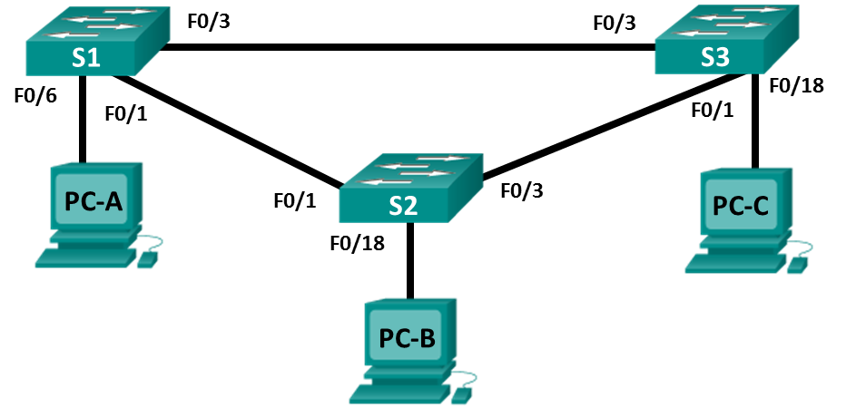

# Настройка расширенных сетей VLAN, VTP и DTP

### Топология

### Таблица адресации
|Устройство|Интерфейс|IP-адрес     |Маска подсети|
|----------|---------|-------------|-------------|
|S1        |VLAN 99  |192.168.99.1 |255.255.255.0|
|S2        |VLAN 99  |192.168.99.2 |255.255.255.0|
|S3        |VLAN 99  |192.168.99.3 |255.255.255.0|
|PC-A      |NIC      |192.168.10.1 |255.255.255.0|
|PC-B      |NIC      |192.168.20.1 |255.255.255.0|
|PC-C      |NIC      |192.168.10.2 |255.255.255.0|

### Задачи
1. Настройка VTP
2. Настройка DTP
3. Добавление сетей VLAN и назначение портов
4. Настройка расширенной сети VLAN

### Выполнение

#### 1. Настройка VTP
Настраиваем S2:
vtp domain CCNA
vtp mode server
vtp password cisco

Настраиваем S1 и S3:
vtp domain CCNA
vtp mode client
vtp password cisco

#### 2. Настройка DTP
Настраиваем S1:
interface e0/1
switchport mode dynamic desirable

Настраиваем S1 и S3:
interface e0/3
switchport mode trunk

#### 3. Добавление VLAN
На S2:
vlan 10
name Red
Svlan 20
name Blue
vlan 30
name vlan 30
name Yellow 
vlan 99
name Management

Настройка S1:
interface e0/2
switchport mode access
switchport access vlan 10
interface vlan 99
ip address 192.168.99.1 255.255.255.0
no shutdown

Настройка S2:
interface e0/2
switchport mode access
switchport access vlan 20
interface vlan 99
ip address 192.168.99.2 255.255.255.0
no shutdown

Настройка S3:
interface e0/2
switchport mode access
switchport access vlan 10
interface vlan 99
ip address 192.168.99.3 255.255.255.0
no shutdown

#### 4. Настройка расширенной сети VLAN
Настройка S1:
vtp mode transparent
vlan 2000
