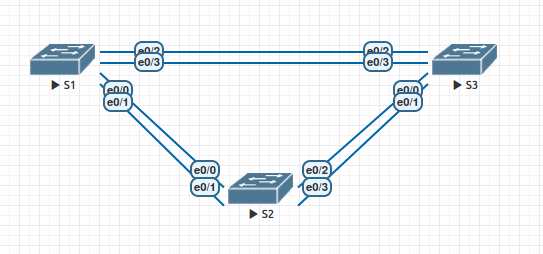

# Настройка STP

### Топология


### Таблица адресации
|Устройство|Интерфейс|IP-адрес     |Маска подсети|
|----------|---------|-------------|-------------|
|S1        |VLAN 1   |192.168.1.1  |255.255.255.0|
|S2        |VLAN 1   |192.168.1.2  |255.255.255.0|
|S3        |VLAN 1   |192.168.1.3  |255.255.255.0|

### Задачи
1. Создание сети и настройка основных параметров устройства
2. Выбор корневого моста
3. Наблюдение за процессом выбора протоколом STP порта, исходя из стоимости портов
4. Наблюдение за процессом выбора протоколом STP порта, исходя из приоритета портов

### Выполнение

#### 1. Создание сети и настройка основных параметров устройства
Выполняем базовую настройку на коммутаторах
```
conf t
hostname SX
no ip domain-lookup
enable secret class
line console 0
password cisco
login
exec-timeout 0 0
exit
line vty 0 4
password cisco
login
exit

interface vlan 1
ip address 192.168.1.X 255.255.255.0
no shutdown
exit


service password-encryption
banner motd $ Authorized Access Only! $
```

Проверяем сетевую доступность между коммутаторами
```
S2#ping 192.168.1.3
Type escape sequence to abort.
Sending 5, 100-byte ICMP Echos to 192.168.1.3, timeout is 2 seconds:
.!!!!
Success rate is 80 percent (4/5), round-trip min/avg/max = 1/1/1 ms
S2#ping 192.168.1.1
Type escape sequence to abort.
Sending 5, 100-byte ICMP Echos to 192.168.1.1, timeout is 2 seconds:
.!!!!
Success rate is 80 percent (4/5), round-trip min/avg/max = 1/1/1 ms

```

#### 2. Выбор корневого моста
Выполняем настройки на коммутаторах
```
interface range ethernet 0/0-3  
shutdown
switchport trunk encapsulation dot1q
switchport mode trunk
exit
interface ethernet 0/1
no shutdown
exit
interface ethernet 0/3
no shutdown
exit

```

Результат show spanning-tree на S1
```
S1#show spanning-tree 

VLAN0001
  Spanning tree enabled protocol ieee
  Root ID    Priority    32769
             Address     aabb.cc00.1000
             This bridge is the root
             Hello Time   2 sec  Max Age 20 sec  Forward Delay 15 sec

  Bridge ID  Priority    32769  (priority 32768 sys-id-ext 1)
             Address     aabb.cc00.1000
             Hello Time   2 sec  Max Age 20 sec  Forward Delay 15 sec
             Aging Time  300 sec

Interface           Role Sts Cost      Prio.Nbr Type
------------------- ---- --- --------- -------- --------------------------------
Et0/1               Desg FWD 100       128.2    Shr 
Et0/3               Desg FWD 100       128.4    Shr 

```

Результат show spanning-tree на S2
```
S2#show spanning-tree 

VLAN0001
  Spanning tree enabled protocol ieee
  Root ID    Priority    32769
             Address     aabb.cc00.1000
             Cost        100
             Port        2 (Ethernet0/1)
             Hello Time   2 sec  Max Age 20 sec  Forward Delay 15 sec

  Bridge ID  Priority    32769  (priority 32768 sys-id-ext 1)
             Address     aabb.cc00.2000
             Hello Time   2 sec  Max Age 20 sec  Forward Delay 15 sec
             Aging Time  300 sec

Interface           Role Sts Cost      Prio.Nbr Type
------------------- ---- --- --------- -------- --------------------------------
Et0/1               Root FWD 100       128.2    Shr 
Et0/3               Desg FWD 100       128.4    Shr 

```

Результат show spanning-tree на S3
```
S3#show spanning-tree 

VLAN0001
  Spanning tree enabled protocol ieee
  Root ID    Priority    32769
             Address     aabb.cc00.1000
             Cost        100
             Port        4 (Ethernet0/3)
             Hello Time   2 sec  Max Age 20 sec  Forward Delay 15 sec

  Bridge ID  Priority    32769  (priority 32768 sys-id-ext 1)
             Address     aabb.cc00.3000
             Hello Time   2 sec  Max Age 20 sec  Forward Delay 15 sec
             Aging Time  300 sec

Interface           Role Sts Cost      Prio.Nbr Type
------------------- ---- --- --------- -------- --------------------------------
Et0/1               Altn BLK 100       128.2    Shr 
Et0/3               Root FWD 100       128.4    Shr 
```

Корневым мостом стал коммутатор S1, т.к. у него MAC-адрес с самым низким значением.


Корневые порты: S2 - Et0/1; S3 - Et0/3.

Назначенные порты: S1 - Et0/1, Et0/3; S2 - Et0/3.

Альтернативные порты: S3 - Et0/1. Данный порт выбран, т.к. у него самая высокая метрика (путь к корневому коммутатору проходит через S2).

#### 3. Наблюдение за процессом выбора протоколом STP порта, исходя из стоимости портов
На S3 меняем стоимость порта:
```
interface e0/3
spanning-tree cost 18
```

В результате блокируемый порт стал Et0/3 на S2
```
S3(config)#do show spanning-tree 

VLAN0001
  Spanning tree enabled protocol ieee
  Root ID    Priority    32769
             Address     aabb.cc00.1000
             Cost        18
             Port        4 (Ethernet0/3)
             Hello Time   2 sec  Max Age 20 sec  Forward Delay 15 sec

  Bridge ID  Priority    32769  (priority 32768 sys-id-ext 1)
             Address     aabb.cc00.3000
             Hello Time   2 sec  Max Age 20 sec  Forward Delay 15 sec
             Aging Time  15  sec

Interface           Role Sts Cost      Prio.Nbr Type
------------------- ---- --- --------- -------- --------------------------------
Et0/1               Desg LIS 100       128.2    Shr 
Et0/3               Root FWD 18        128.4    Shr 
```

```
S2#show spanning-tree 

VLAN0001
  Spanning tree enabled protocol ieee
  Root ID    Priority    32769
             Address     aabb.cc00.1000
             Cost        100
             Port        2 (Ethernet0/1)
             Hello Time   2 sec  Max Age 20 sec  Forward Delay 15 sec

  Bridge ID  Priority    32769  (priority 32768 sys-id-ext 1)
             Address     aabb.cc00.2000
             Hello Time   2 sec  Max Age 20 sec  Forward Delay 15 sec
             Aging Time  300 sec

Interface           Role Sts Cost      Prio.Nbr Type
------------------- ---- --- --------- -------- --------------------------------
Et0/1               Root FWD 100       128.2    Shr 
Et0/3               Altn BLK 100       128.4    Shr 
```

Удаляем изменение стоимости порта на S3:
```
interface e0/3
no spanning-tree cost 18
```

Блокируемый порт вновь стал Et0/1 на S3.

#### 4. Наблюдение за процессом выбора протоколом STP порта, исходя из приоритета портов
Активируем избыточные пути на всех коммутаторах
```
interface ethernet 0/0
no shutdown
exit
interface ethernet 0/2
no shutdown
exit
```

Корневым портом на S2 стал Et0/0 (наименьший из возможных Et0/0 и Et0/1):
```
S2(config)#do show spanning-tree 

VLAN0001
  Spanning tree enabled protocol ieee
  Root ID    Priority    32769
             Address     aabb.cc00.1000
             Cost        100
             Port        1 (Ethernet0/0)
             Hello Time   2 sec  Max Age 20 sec  Forward Delay 15 sec

  Bridge ID  Priority    32769  (priority 32768 sys-id-ext 1)
             Address     aabb.cc00.2000
             Hello Time   2 sec  Max Age 20 sec  Forward Delay 15 sec
             Aging Time  300 sec

Interface           Role Sts Cost      Prio.Nbr Type
------------------- ---- --- --------- -------- --------------------------------
Et0/0               Root FWD 100       128.1    Shr 
Et0/1               Altn BLK 100       128.2    Shr 
Et0/2               Desg FWD 100       128.3    Shr 
Et0/3               Desg FWD 100       128.4    Shr 
```


Корневым портом на S3 стал Et0/2 (наименьший из возможных Et0/2 и Et0/3):
```
S3(config)#do show spanning-tree 

VLAN0001
  Spanning tree enabled protocol ieee
  Root ID    Priority    32769
             Address     aabb.cc00.1000
             Cost        100
             Port        3 (Ethernet0/2)
             Hello Time   2 sec  Max Age 20 sec  Forward Delay 15 sec

  Bridge ID  Priority    32769  (priority 32768 sys-id-ext 1)
             Address     aabb.cc00.3000
             Hello Time   2 sec  Max Age 20 sec  Forward Delay 15 sec
             Aging Time  300 sec

Interface           Role Sts Cost      Prio.Nbr Type
------------------- ---- --- --------- -------- --------------------------------
Et0/0               Altn BLK 100       128.1    Shr 
Et0/1               Altn BLK 100       128.2    Shr 
Et0/2               Root FWD 100       128.3    Shr 
Et0/3               Altn BLK 100       128.4    Shr 
```
