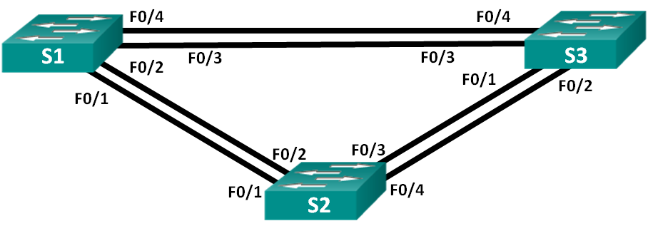

# Настройка STP

### Топология

### Таблица адресации
|Устройство|Интерфейс|IP-адрес     |Маска подсети|
|----------|---------|-------------|-------------|
|S1        |VLAN 1   |192.168.1.1  |255.255.255.0|
|S2        |VLAN 1   |192.168.1.2  |255.255.255.0|
|S3        |VLAN 1   |192.168.1.3  |255.255.255.0|

### Задачи
1. Создание сети и настройка основных параметров устройства
2. Выбор корневого моста
3. Наблюдение за процессом выбора протоколом STP порта, исходя из стоимости портов
4. Наблюдение за процессом выбора протоколом STP порта, исходя из приоритета портов

### Выполнение

#### 1. Создание сети и настройка основных параметров устройства
