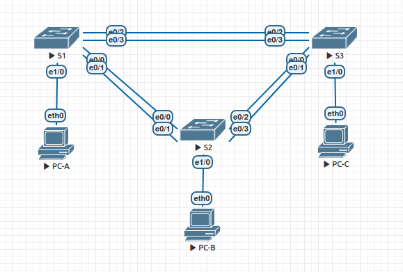

# Настройка EtherChannel

### Топология


### Таблица адресации
|Устройство|Интерфейс|IP-адрес     |Маска подсети|
|----------|---------|-------------|-------------|
|S1        |VLAN 99  |192.168.99.11|255.255.255.0|
|S2        |VLAN 99  |192.168.99.12|255.255.255.0|
|S3        |VLAN 99  |192.168.99.13|255.255.255.0|
|PC-A      |NIC      |192.168.10.1 |255.255.255.0|
|PC-B      |NIC      |192.168.10.2 |255.255.255.0|
|PC-C      |NIC      |192.168.10.3 |255.255.255.0|

### Задачи
Часть 1. Настройка базовых параметров коммутатора

Часть 2. Настройка PAgP

Часть 3. Настройка LACP

### Выполнение

#### 1. Настройка базовых параметров коммутатора
Выполняем базовую настройку на коммутаторах:
```
conf t
hostname SX
no ip domain-lookup
enable secret class
line console 0
password cisco
login
exec-timeout 0 0
exit
line vty 0 4
password cisco
login
exit
line aux 0
password cisco
login
exit

service password-encryption
banner motd $ Authorized Access Only! $

vlan 99
name Managment
interface vlan 99
ip address 192.168.99.1X 255.255.255.0
no shutdown
exit

vlan 10
name Staff
exit

interface range ethernet 0/0-3  
shutdown
interface range ethernet 1/0-3  
shutdown

int ethernet 1/0
switchport mode access
switchport access vlan 10
no sh
```

### 2. Настройка PAgP
Выполняем настройки на портах коммутатора S1:
```
interface range e0/2-3
channel-group 1 mode desirable
no shutdown
```

Выполняем настройки на портах коммутатора S3:
```
interface range e0/2-3
channel-group 1 mode auto
no shutdown
```


Результат:
```
*Mar 24 19:13:29.930: %LINEPROTO-5-UPDOWN: Line protocol on Interface Port-channel1, changed state to up

S1(config)#do show etherchannel summary 
Flags:  D - down        P - bundled in port-channel
        I - stand-alone s - suspended
        H - Hot-standby (LACP only)
        R - Layer3      S - Layer2
        U - in use      f - failed to allocate aggregator

        M - not in use, minimum links not met
        u - unsuitable for bundling
        w - waiting to be aggregated
        d - default port


Number of channel-groups in use: 1
Number of aggregators:           1

Group  Port-channel  Protocol    Ports
------+-------------+-----------+-----------------------------------------------
1      Po1(SU)         PAgP      Et0/2(P)    Et0/3(P) 

S3(config)#do show etherchannel summary 
Flags:  D - down        P - bundled in port-channel
        I - stand-alone s - suspended
        H - Hot-standby (LACP only)
        R - Layer3      S - Layer2
        U - in use      f - failed to allocate aggregator

        M - not in use, minimum links not met
        u - unsuitable for bundling
        w - waiting to be aggregated
        d - default port


Number of channel-groups in use: 1
Number of aggregators:           1

Group  Port-channel  Protocol    Ports
------+-------------+-----------+-----------------------------------------------
1      Po1(SU)         PAgP      Et0/2(P)    Et0/3(P)   
```

На S1 и S3 настраиваем транковые порты:
```
int port-channel 1
switchport trunk encapsulation dot1q 
switchport mode trunk                
switchport trunk native vlan 99
```


### 3. Настройка LACP
Настраиваем LACP на интерфейсах коммутатора S1:
```
int ran e0/0-1
switchport trunk encapsulation dot1q 
switchport mode trunk 
switchport trunk native vlan 99
channel-group 2 mode active
no sh
```

Настраиваем LACP на интерфейсах коммутатора S2:
```
int ran e0/0-1
switchport trunk encapsulation dot1q 
switchport mode trunk 
switchport trunk native vlan 99
channel-group 2 mode passive
no sh

int ran e0/2-3
switchport trunk encapsulation dot1q 
switchport mode trunk 
switchport trunk native vlan 99
channel-group 3 mode active
no sh
```

Настраиваем LACP на интерфейсах коммутатора S3:
```
int ran e0/0-1
switchport trunk encapsulation dot1q 
switchport mode trunk 
switchport trunk native vlan 99
channel-group 3 mode passive
no sh
```

Результат:
```
S1#sh etherchannel sum
Flags:  D - down        P - bundled in port-channel
        I - stand-alone s - suspended
        H - Hot-standby (LACP only)
        R - Layer3      S - Layer2
        U - in use      f - failed to allocate aggregator

        M - not in use, minimum links not met
        u - unsuitable for bundling
        w - waiting to be aggregated
        d - default port


Number of channel-groups in use: 2
Number of aggregators:           2

Group  Port-channel  Protocol    Ports
------+-------------+-----------+-----------------------------------------------
1      Po1(SU)         PAgP      Et0/2(P)    Et0/3(P)    
2      Po2(SU)         LACP      Et0/0(P)    Et0/1(P) 
```

```
S2#sh etherchannel sum
Flags:  D - down        P - bundled in port-channel
        I - stand-alone s - suspended
        H - Hot-standby (LACP only)
        R - Layer3      S - Layer2
        U - in use      f - failed to allocate aggregator

        M - not in use, minimum links not met
        u - unsuitable for bundling
        w - waiting to be aggregated
        d - default port


Number of channel-groups in use: 2
Number of aggregators:           2

Group  Port-channel  Protocol    Ports
------+-------------+-----------+-----------------------------------------------
2      Po2(SU)         LACP      Et0/0(P)    Et0/1(P)    
3      Po3(SU)         LACP      Et0/2(P)    Et0/3(P)
```

```
S3#sh etherchannel sum
Flags:  D - down        P - bundled in port-channel
        I - stand-alone s - suspended
        H - Hot-standby (LACP only)
        R - Layer3      S - Layer2
        U - in use      f - failed to allocate aggregator

        M - not in use, minimum links not met
        u - unsuitable for bundling
        w - waiting to be aggregated
        d - default port


Number of channel-groups in use: 2
Number of aggregators:           2

Group  Port-channel  Protocol    Ports
------+-------------+-----------+-----------------------------------------------
1      Po1(SU)         PAgP      Et0/2(P)    Et0/3(P)    
3      Po3(SU)         LACP      Et0/0(P)    Et0/1(P) 
```

Проверяем сетевое взаимодействие между PC:
```
VPCS> ping 192.168.10.1

84 bytes from 192.168.10.1 icmp_seq=1 ttl=64 time=0.259 ms
84 bytes from 192.168.10.1 icmp_seq=2 ttl=64 time=0.301 ms
84 bytes from 192.168.10.1 icmp_seq=3 ttl=64 time=0.465 ms
84 bytes from 192.168.10.1 icmp_seq=4 ttl=64 time=0.390 ms
^C
VPCS> ping 192.168.10.3

84 bytes from 192.168.10.3 icmp_seq=1 ttl=64 time=0.349 ms
84 bytes from 192.168.10.3 icmp_seq=2 ttl=64 time=0.467 ms
84 bytes from 192.168.10.3 icmp_seq=3 ttl=64 time=0.489 ms
84 bytes from 192.168.10.3 icmp_seq=4 ttl=64 time=0.545 ms
```

Проверяем сетевое взаимодействие между коммутаторами:
```
S2#ping 192.168.99.11
Type escape sequence to abort.
Sending 5, 100-byte ICMP Echos to 192.168.99.11, timeout is 2 seconds:
.!!!!
Success rate is 80 percent (4/5), round-trip min/avg/max = 1/1/1 ms
S2#ping 192.168.99.13
Type escape sequence to abort.
Sending 5, 100-byte ICMP Echos to 192.168.99.13, timeout is 2 seconds:
.!!!!
Success rate is 80 percent (4/5), round-trip min/avg/max = 1/1/1 ms
```
