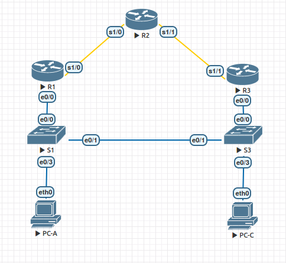

# Настройка HSRP

### Топология


### Таблица адресации
|Устройство|Интерфейс    |IP-адрес     |Маска подсети  |Шлюз по умолчанию|
|----------|-------------|-------------|---------------|-|
|R1        |E0/0         |192.168.1.1  |255.255.255.0  |-|
|          |S/1/0 (DCE)  |10.1.1.1     |255.255.255.252|-|
|R2        |S/1/0        |10.1.1.2     |255.255.255.252|-|
|          |S/1/1 (DCE)  |10.2.2.2     |255.255.255.252|-|
|          |Lo1          |209.165.200.225|255.255.255.224|-|
|R3        |E0/0         |192.168.1.3  |255.255.255.0  |-|
|          |S/1/1        |10.2.2.1     |255.255.255.252|-|
|S1        |VLAN 1       |192.168.1.11 |255.255.255.0  |192.168.1.1|
|S3        |VLAN 1       |192.168.1.13 |255.255.255.0  |192.168.1.3|
|PC-A      |NIC          |192.168.1.31 |255.255.255.0  |192.168.1.1|
|PC-C      |NIC          |192.168.1.33 |255.255.255.0  |192.168.1.3|

### Задачи
Часть 1. Построение сети и проверка соединения

Часть 2. Настройка обеспечения избыточности на первом хопе с помощью HSRP

### Выполнение

#### 1. Построение сети и проверка соединения
##### Выполняем базовую настройку маршрутизаторов и коммутаторов:
```
conf t
hostname RX (SX)
no ip domain-lookup
enable secret class
line console 0
password cisco
login
exec-timeout 0 0
exit
line vty 0 4
password cisco
login
exit
line aux 0
password cisco
login
exit
service password-encryption
banner motd $ Authorized Access Only! $
```

Настраиваем интерфейсы на маршрутизаторах:

-----R1 ------------
```
int serial1/0 
ip address 10.1.1.1 255.255.255.252
clock rate 128000
no sh
```
-----R2 ------------
```
int serial1/0
ip address 10.1.1.2 255.255.255.252
no sh
int serial1/1
ip address 10.2.2.2 255.255.255.252
clock rate 128000
no sh
```
-----R3 ------------
```
int serial1/1 
ip address 10.2.2.1 255.255.255.252
no sh
```


Настраиваем интерфейсы на коммутаторах:

--- S1 ----
```
vlan 1
interface vlan 1
ip address 192.168.1.11 255.255.255.0
no shutdown
exit
ip default-gateway 192.168.1.1
```

--- S3 ----
```
vlan 1
interface vlan 1
ip address 192.168.1.13 255.255.255.0
no shutdown
exit
ip default-gateway 192.168.1.3
```

##### Настройка RIP
--- R1 ----
```
router rip
version 2
network 192.168.1.0
network 10.0.0.0
```

--- R2 ----
```
router rip
version 2
network 10.0.0.0
default-information originate
```

--- R3 ----
```
router rip
version 2
network 192.168.1.0
network 10.0.0.0
```

Проверим таблицы маршрутизации:

--- R1 ----
```
R1(config)#do sh ip route
Codes: L - local, C - connected, S - static, R - RIP, M - mobile, B - BGP
       D - EIGRP, EX - EIGRP external, O - OSPF, IA - OSPF inter area 
       N1 - OSPF NSSA external type 1, N2 - OSPF NSSA external type 2
       E1 - OSPF external type 1, E2 - OSPF external type 2
       i - IS-IS, su - IS-IS summary, L1 - IS-IS level-1, L2 - IS-IS level-2
       ia - IS-IS inter area, * - candidate default, U - per-user static route
       o - ODR, P - periodic downloaded static route, H - NHRP, l - LISP
       a - application route
       + - replicated route, % - next hop override

Gateway of last resort is 10.1.1.2 to network 0.0.0.0

R*    0.0.0.0/0 [120/1] via 10.1.1.2, 00:00:21, Serial1/0
      10.0.0.0/8 is variably subnetted, 4 subnets, 3 masks
R        10.0.0.0/8 [120/1] via 192.168.1.3, 00:00:04, Ethernet0/0
C        10.1.1.0/30 is directly connected, Serial1/0
L        10.1.1.1/32 is directly connected, Serial1/0
R        10.2.2.0/30 [120/1] via 10.1.1.2, 00:00:21, Serial1/0
      192.168.1.0/24 is variably subnetted, 2 subnets, 2 masks
C        192.168.1.0/24 is directly connected, Ethernet0/0
L        192.168.1.1/32 is directly connected, Ethernet0/0
```

--- R2 ----
```
R2(config-router)#do sh ip route               
Codes: L - local, C - connected, S - static, R - RIP, M - mobile, B - BGP
       D - EIGRP, EX - EIGRP external, O - OSPF, IA - OSPF inter area 
       N1 - OSPF NSSA external type 1, N2 - OSPF NSSA external type 2
       E1 - OSPF external type 1, E2 - OSPF external type 2
       i - IS-IS, su - IS-IS summary, L1 - IS-IS level-1, L2 - IS-IS level-2
       ia - IS-IS inter area, * - candidate default, U - per-user static route
       o - ODR, P - periodic downloaded static route, H - NHRP, l - LISP
       a - application route
       + - replicated route, % - next hop override

Gateway of last resort is not set

      10.0.0.0/8 is variably subnetted, 5 subnets, 3 masks
R        10.0.0.0/8 [120/2] via 10.2.2.1, 00:00:19, Serial1/1
                    [120/2] via 10.1.1.1, 00:00:20, Serial1/0
C        10.1.1.0/30 is directly connected, Serial1/0
L        10.1.1.2/32 is directly connected, Serial1/0
C        10.2.2.0/30 is directly connected, Serial1/1
L        10.2.2.2/32 is directly connected, Serial1/1
R     192.168.1.0/24 [120/1] via 10.2.2.1, 00:00:19, Serial1/1
                     [120/1] via 10.1.1.1, 00:00:20, Serial1/0
      209.165.200.0/24 is variably subnetted, 2 subnets, 2 masks
C        209.165.200.224/27 is directly connected, Loopback1
L        209.165.200.225/32 is directly connected, Loopback1
```

--- R3 ----
```
R3(config)#do sh ip route
Codes: L - local, C - connected, S - static, R - RIP, M - mobile, B - BGP
       D - EIGRP, EX - EIGRP external, O - OSPF, IA - OSPF inter area 
       N1 - OSPF NSSA external type 1, N2 - OSPF NSSA external type 2
       E1 - OSPF external type 1, E2 - OSPF external type 2
       i - IS-IS, su - IS-IS summary, L1 - IS-IS level-1, L2 - IS-IS level-2
       ia - IS-IS inter area, * - candidate default, U - per-user static route
       o - ODR, P - periodic downloaded static route, H - NHRP, l - LISP
       a - application route
       + - replicated route, % - next hop override

Gateway of last resort is 10.2.2.2 to network 0.0.0.0

R*    0.0.0.0/0 [120/1] via 10.2.2.2, 00:00:03, Serial1/1
      10.0.0.0/8 is variably subnetted, 4 subnets, 3 masks
R        10.0.0.0/8 [120/1] via 192.168.1.1, 00:00:18, Ethernet0/0
R        10.1.1.0/30 [120/1] via 10.2.2.2, 00:00:03, Serial1/1
C        10.2.2.0/30 is directly connected, Serial1/1
L        10.2.2.1/32 is directly connected, Serial1/1
      192.168.1.0/24 is variably subnetted, 2 subnets, 2 masks
C        192.168.1.0/24 is directly connected, Ethernet0/0
L        192.168.1.3/32 is directly connected, Ethernet0/0
```
