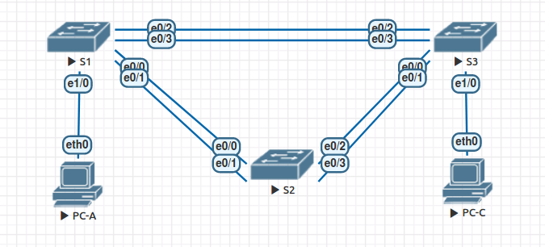

# Поиск и устранение неполадок в работе EtherChannel

### Топология


### Таблица адресации
|Устройство|Интерфейс|IP-адрес     |Маска подсети|
|----------|---------|-------------|-------------|
|S1        |VLAN 99  |192.168.1.11 |255.255.255.0|
|S2        |VLAN 99  |192.168.1.12 |255.255.255.0|
|S3        |VLAN 99  |192.168.1.13 |255.255.255.0|
|PC-A      |NIC      |192.168.0.1  |255.255.255.0|
|PC-C      |NIC      |192.168.0.3  |255.255.255.0|

### Задачи
Часть 1. Построение сети и загрузка настроек устройств

Часть 2. Отладка EtherChannel

### Выполнение

#### 1. Построение сети и загрузка настроек устройств
Первоначальная конфигурация коммутаторов:

---- S1 ----
```
hostname S1
interface range e0/0-3, e1/0-3
shutdown
exit
enable secret class
no ip domain lookup
line vty 0 4
password cisco
login
line con 0
 password cisco
 logging synchronous
 login
 exit
vlan 10
 name User
vlan 99
 Name Management

interface range e0/0-1
switchport trunk encapsulation dot1q
 switchport mode trunk
 channel-group 1 mode active
 switchport trunk native vlan 99
 no shutdown

interface range e0/2-3
 channel-group 2 mode desirable
 switchport trunk encapsulation dot1q
 switchport trunk native vlan 99
 no shutdown

interface e1/0
 switchport mode access
 switchport access vlan 10
 no shutdown

interface vlan 99
 ip address 192.168.1.11 255.255.255.0

interface port-channel 1
 switchport trunk native vlan 99
 switchport trunk encapsulation dot1q
 switchport mode trunk
interface port-channel 2
 switchport trunk native vlan 99
 switchport mode access
```

---- S2 ----
```
hostname S2
interface range e0/0-3, e1/0-3
 shutdown
 exit
enable secret class
no ip domain lookup

line vty 0 4
 password cisco
 login
line con 0
 password cisco
 logging synchronous
 login
 exit

vlan 10
 name User
vlan 99
 name Management

spanning-tree vlan 1,10,99 root primary

interface range e0/0-1
 switchport trunk encapsulation dot1q
 switchport mode trunk
 channel-group 1 mode desirable
 switchport trunk native vlan 99
 no shutdown

interface range e0/2-3
 switchport trunk encapsulation dot1q
 switchport mode trunk
 channel-group 3 mode desirable
 switchport trunk native vlan 99

interface vlan 99
 ip address 192.168.1.12 255.255.255.0

interface port-channel 1
 switchport trunk native vlan 99
 switchport trunk allowed vlan 1,99

interface port-channel 3
 switchport trunk native vlan 99
 switchport trunk allowed vlan 1,10,99
 switchport trunk encapsulation dot1q
 switchport mode trunk
```

---- S3 ----
```
hostname S3
interface range e0/0-3, e1/0-3
 shutdown
 exit
enable secret class
no ip domain lookup

line vty 0 4
 password cisco
 login
line con 0
 password cisco
 logging synchronous
 login
 exit

vlan 10
 name User

vlan 99
 name Management

interface range e0/0-1

interface range e0/2-3
 switchport trunk encapsulation dot1q
 switchport mode trunk
 channel-group 3 mode desirable
 switchport trunk native vlan 99
 no shutdown

interface e1/0
 switchport mode access
 switchport access vlan 10
 no shutdown

interface vlan 99
 ip address 192.168.1.13 255.255.255.0

interface port-channel 3
 switchport trunk encapsulation dot1q
 switchport trunk native vlan 99
 switchport mode trunk
```

### 2. Поиск и устранение неисправностей в EtherChannel
Проверка коммутатора S1:
```
S1(config-if)#do sh int trunk

Port        Mode             Encapsulation  Status        Native vlan
Et0/0       on               802.1q         trunking      99
Et0/1       on               802.1q         trunking      99

Port        Vlans allowed on trunk
Et0/0       none
Et0/1       none

Port        Vlans allowed and active in management domain
Et0/0       none
Et0/1       none

Port        Vlans in spanning tree forwarding state and not pruned
Et0/0       none
Et0/1       none

```

```
S1#show etherchannel summary
Flags:  D - down        P - bundled in port-channel
        I - stand-alone s - suspended
        H - Hot-standby (LACP only)
        R - Layer3      S - Layer2
        U - in use      f - failed to allocate aggregator

        M - not in use, minimum links not met
        u - unsuitable for bundling
        w - waiting to be aggregated
        d - default port


Number of channel-groups in use: 2
Number of aggregators:           2

Group  Port-channel  Protocol    Ports
------+-------------+-----------+-----------------------------------------------
1      Po1(SD)         LACP      Et0/0(s)    Et0/1(s)    
2      Po2(SU)         PAgP      Et0/2(P)    Et0/3(P) 
```

##### Исправляем конфигурацию S1:
```
interface range e0/0-1
no channel-group 1 mode active
channel-group 1 mode desirable

int range e0/2-3
switchport mode trunk

interface vlan 99
 no shutdown
```

Проверка коммутатора S2:
```
S2(config-if)#do sh int tru

Port        Mode             Encapsulation  Status        Native vlan
Et0/0       on               802.1q         trunking      99
Et0/1       on               802.1q         trunking      99

Port        Vlans allowed on trunk
Et0/0       1,99
Et0/1       1,99

Port        Vlans allowed and active in management domain
Et0/0       1,99
Et0/1       1,99

Port        Vlans in spanning tree forwarding state and not pruned
Et0/0       none
Et0/1       none
```

##### Исправляем конфигурацию S2:
```
interface range e0/2-3
no shutdown

interface vlan 99
 no shutdown
```

Проверка коммутатора S3:
```
S3(config-if)#do sh int trun

Port        Mode             Encapsulation  Status        Native vlan
Po3         on               802.1q         trunking      99

Port        Vlans allowed on trunk
Po3         1-4094

Port        Vlans allowed and active in management domain
Po3         1,10,99

Port        Vlans in spanning tree forwarding state and not pruned
Po3         none
```

##### Исправляем конфигурацию S3:
```
interface range e0/0-1
 switchport trunk encapsulation dot1q
 switchport mode trunk
 channel-group 2 mode desirable
 switchport trunk native vlan 99
 no shutdown
 
interface vlan 99
 no shutdown
```


### Проверяем сетевое взаимодействие

Между коммутаторами:
```
S1(config-if)#do ping 192.168.1.13
Type escape sequence to abort.
Sending 5, 100-byte ICMP Echos to 192.168.1.13, timeout is 2 seconds:
.!!!!
Success rate is 80 percent (4/5), round-trip min/avg/max = 1/1/1 ms
S1(config-if)#do ping 192.168.1.12
Type escape sequence to abort.
Sending 5, 100-byte ICMP Echos to 192.168.1.12, timeout is 2 seconds:
.!!!!
Success rate is 80 percent (4/5), round-trip min/avg/max = 1/1/1 ms
```

Между PC:
```
PC-C> ping 192.168.0.2

84 bytes from 192.168.0.2 icmp_seq=1 ttl=64 time=0.519 ms
84 bytes from 192.168.0.2 icmp_seq=2 ttl=64 time=0.425 ms
84 bytes from 192.168.0.2 icmp_seq=3 ttl=64 time=0.441 ms
84 bytes from 192.168.0.2 icmp_seq=4 ttl=64 time=0.428 ms
84 bytes from 192.168.0.2 icmp_seq=5 ttl=64 time=0.453 ms
```
