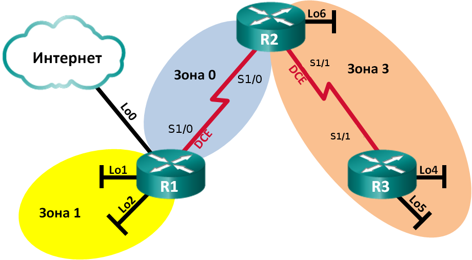

# Настройка OSPFv2 для нескольких областей

### Топология


Магистральные маршрутизаторы: R1, R2.

ASBR: R1.

ABR: R1, R2.

Внутренние маршрутизаторы: R3.


### Таблица адресации
|Устройство|Интерфейс    |IP-адрес       |Маска подсети   |
|----------|-------------|---------------|----------------|
|R1        |Lo0          |209.165.200.225|255.255.255.252 |
|          |Lo1          |192.168.1.1  |255.255.255.0     |
|          |Lo2          |192.168.2.1  |255.255.255.0     |
|          |S1/0 (DCE)   |192.168.12.1 |255.255.255.252   |
|R2        |Lo6          |192.168.6.1  |255.255.255.0     |
|          |S1/0         |192.168.12.2 |255.255.255.252   |
|          |S1/1 (DCE)   |192.168.23.1 |255.255.255.252   |
|R3        |Lo4          |192.168.4.1  |255.255.255.0     |
|          |Lo5          |192.168.5.1  |255.255.255.0     |
|          |S/1/1        |192.168.23.2 |255.255.255.252   |

### Задачи
1. Создание сети и настройка основных параметров устройства

2. Настройка сети OSPFv2 для нескольких областей

3. Настройка межобластных суммарных маршрутов

### Выполнение

#### 1. Создание сети и настройка основных параметров устройства

Выполняем базовую настройку маршрутизаторов:
```
conf t
hostname RX
no ip domain-lookup
enable secret class
line console 0
password cisco
login
exec-timeout 0 0
exit
line vty 0 4
password cisco
login
exit
line aux 0
password cisco
login
exit
service password-encryption
banner motd $ Authorized Access Only! $
```

Выполняем настройку интерфейсов:

-----R1 ------------
```
int lo0
ip address 209.165.200.225 255.255.255.252
no sh
int lo1
ip address 192.168.1.1 255.255.255.0
no sh
int lo2
ip address 192.168.2.1 255.255.255.0
no sh
int serial1/0 
ip address 192.168.12.1 255.255.255.252
clock rate 128000
bandwidth 128
no sh
```

-----R2 ------------
```
int lo6
ip address 192.168.6.1 255.255.255.0
no sh
int serial1/0 
ip address 192.168.12.2 255.255.255.252
no sh
int serial1/1
ip address 192.168.23.1 255.255.255.252
clock rate 128000
bandwidth 128
no sh
```

-----R3 ------------
```
int lo4
ip address 192.168.4.1 255.255.255.0
no sh
int lo5
ip address 192.168.5.1 255.255.255.0
no sh
int serial1/1 
ip address 192.168.23.2 255.255.255.252
no sh
```

#### 2. Настройка сети OSPFv2 для нескольких областей

Настройка OSPF:
--- R1 ----
```
ip route 0.0.0.0 0.0.0.0 lo0
router ospf 1
router-id 1.1.1.1
network 192.168.1.0 0.0.0.255 area 1
network 192.168.2.0 0.0.0.255 area 1
network 192.168.12.0 0.0.0.3 area 0
passive-interface Lo1 
passive-interface Lo2
default-information originate
```

--- R2 ----
```
router ospf 1
router-id 2.2.2.2
network 192.168.6.0 0.0.0.255 area 3
network 192.168.12.0 0.0.0.3 area 0
network 192.168.23.0 0.0.0.3 area 3
passive-interface Lo6
```

--- R3 ----
```
router ospf 1
router-id 3.3.3.3
network 192.168.4.0 0.0.0.255 area 3
network 192.168.5.0 0.0.0.255 area 3
network 192.168.23.0 0.0.0.3 area 3
passive-interface Lo4
passive-interface Lo5
```

Проверка корректности настройки OSPF:
```
R1(config)#do sh ip protocols 
*** IP Routing is NSF aware ***

Routing Protocol is "application"
  Sending updates every 0 seconds
  Invalid after 0 seconds, hold down 0, flushed after 0
  Outgoing update filter list for all interfaces is not set
  Incoming update filter list for all interfaces is not set
  Maximum path: 32
  Routing for Networks:
  Routing Information Sources:
    Gateway         Distance      Last Update
  Distance: (default is 4)

Routing Protocol is "ospf 1"
  Outgoing update filter list for all interfaces is not set
  Incoming update filter list for all interfaces is not set
  Router ID 1.1.1.1
  It is an area border and autonomous system boundary router
 Redistributing External Routes from,
  Number of areas in this router is 2. 2 normal 0 stub 0 nssa
  Maximum path: 4
  Routing for Networks:
    192.168.1.0 0.0.0.255 area 1
    192.168.2.0 0.0.0.255 area 1
    192.168.12.0 0.0.0.3 area 0
  Passive Interface(s):
    Loopback1
    Loopback2
  Routing Information Sources:
    Gateway         Distance      Last Update
    3.3.3.3              110      00:03:57
    2.2.2.2              110      00:07:09
  Distance: (default is 110)
```

```
R2(config)#do sh ip protocols 
*** IP Routing is NSF aware ***

Routing Protocol is "application"
  Sending updates every 0 seconds
  Invalid after 0 seconds, hold down 0, flushed after 0
  Outgoing update filter list for all interfaces is not set
  Incoming update filter list for all interfaces is not set
  Maximum path: 32
  Routing for Networks:
  Routing Information Sources:
    Gateway         Distance      Last Update
  Distance: (default is 4)

Routing Protocol is "ospf 1"
  Outgoing update filter list for all interfaces is not set
  Incoming update filter list for all interfaces is not set
  Router ID 2.2.2.2
  It is an area border router
  Number of areas in this router is 2. 2 normal 0 stub 0 nssa
  Maximum path: 4
  Routing for Networks:
    192.168.6.0 0.0.0.255 area 3
    192.168.12.0 0.0.0.3 area 0
    192.168.23.0 0.0.0.3 area 3
  Passive Interface(s):
    Loopback6
  Routing Information Sources:
    Gateway         Distance      Last Update
    3.3.3.3              110      00:00:16
    1.1.1.1              110      00:12:02
  Distance: (default is 110)
```

```
R3(config)#do sh ip protocols 
*** IP Routing is NSF aware ***

Routing Protocol is "application"
  Sending updates every 0 seconds
  Invalid after 0 seconds, hold down 0, flushed after 0
  Outgoing update filter list for all interfaces is not set
  Incoming update filter list for all interfaces is not set
  Maximum path: 32
  Routing for Networks:
  Routing Information Sources:
    Gateway         Distance      Last Update
  Distance: (default is 4)

Routing Protocol is "ospf 1"
  Outgoing update filter list for all interfaces is not set
  Incoming update filter list for all interfaces is not set
  Router ID 3.3.3.3
  Number of areas in this router is 1. 1 normal 0 stub 0 nssa
  Maximum path: 4
  Routing for Networks:
    192.168.4.0 0.0.0.255 area 3
    192.168.5.0 0.0.0.255 area 3
    192.168.23.0 0.0.0.3 area 3
  Passive Interface(s):
    Loopback4
    Loopback5
  Routing Information Sources:
    Gateway         Distance      Last Update
    1.1.1.1              110      00:01:05
    2.2.2.2              110      00:01:05
  Distance: (default is 110)
```

```
R1(config)#do sh ip ospf int brief 
Interface    PID   Area            IP Address/Mask    Cost  State Nbrs F/C
Se1/0        1     0               192.168.12.1/30    781   P2P   1/1
Lo1          1     1               192.168.1.1/24     1     LOOP  0/0
Lo2          1     1               192.168.2.1/24     1     LOOP  0/0
```

```
R2(config)#do sh ip ospf int brief 
Interface    PID   Area            IP Address/Mask    Cost  State Nbrs F/C
Se1/0        1     0               192.168.12.2/30    64    P2P   1/1
Lo6          1     3               192.168.6.1/24     1     LOOP  0/0
Se1/1        1     3               192.168.23.1/30    781   P2P   1/1
```

```
R3(config)#do sh ip ospf interface brief 
Interface    PID   Area            IP Address/Mask    Cost  State Nbrs F/C
Lo4          1     3               192.168.4.1/24     1     LOOP  0/0
Lo5          1     3               192.168.5.1/24     1     LOOP  0/0
Se1/1        1     3               192.168.23.2/30    64    P2P   1/1
```

##### Настройка аутентификации MD5
--- R1 ----
```
int serial1/0
ip ospf message-digest-key 1 md5 Cisco123
router ospf 1
area 0 authentication message-digest
```

--- R2 ----
```
int serial1/0
ip ospf message-digest-key 1 md5 Cisco123
int serial1/1
ip ospf message-digest-key 1 md5 Cisco123
router ospf 1
area 0 authentication message-digest
area 3 authentication message-digest
```

--- R3 ----
```
int serial1/1
ip ospf message-digest-key 1 md5 Cisco123
router ospf 1
area 3 authentication message-digest
```

Проверка:
```
R1(config)#do sh ip ospf neighbor 

Neighbor ID     Pri   State           Dead Time   Address         Interface
2.2.2.2           0   FULL/  -        00:00:37    192.168.12.2    Serial1/0
```

```
R2(config)#do sh ip ospf neighbor 

Neighbor ID     Pri   State           Dead Time   Address         Interface
1.1.1.1           0   FULL/  -        00:00:38    192.168.12.1    Serial1/0
3.3.3.3           0   FULL/  -        00:00:32    192.168.23.2    Serial1/1
```

```
R3(config)#do sh ip ospf neighbor 

Neighbor ID     Pri   State           Dead Time   Address         Interface
2.2.2.2           0   FULL/  -        00:00:37    192.168.23.1    Serial1/1
```

#### 3. Настройка межобластных суммарных маршрутов
Таблица LSDB на R1:
```
R1(config)#do sh ip ospf database 

            OSPF Router with ID (1.1.1.1) (Process ID 1)

		Router Link States (Area 0)

Link ID         ADV Router      Age         Seq#       Checksum Link count
1.1.1.1         1.1.1.1         638         0x80000005 0x0035CF 2
2.2.2.2         2.2.2.2         639         0x80000006 0x00DBC4 2
3.3.3.3         3.3.3.3         1895        0x80000001 0x003350 2

		Summary Net Link States (Area 0)

Link ID         ADV Router      Age         Seq#       Checksum
192.168.1.1     1.1.1.1         1931        0x80000002 0x00AC1F
192.168.2.1     1.1.1.1         1931        0x80000002 0x00A129
192.168.4.1     2.2.2.2         536         0x80000001 0x000DA8
192.168.4.1     3.3.3.3         1891        0x80000001 0x005170
192.168.5.1     2.2.2.2         536         0x80000001 0x0002B2
192.168.5.1     3.3.3.3         1891        0x80000001 0x00467A
192.168.6.1     2.2.2.2         61          0x80000002 0x00576B
192.168.23.0    2.2.2.2         1375        0x80000001 0x00297E

		Router Link States (Area 1)
          
Link ID         ADV Router      Age         Seq#       Checksum Link count
1.1.1.1         1.1.1.1         916         0x80000007 0x0092A5 2

		Summary Net Link States (Area 1)

Link ID         ADV Router      Age         Seq#       Checksum
192.168.4.1     1.1.1.1         535         0x80000001 0x00C8E0
192.168.5.1     1.1.1.1         535         0x80000001 0x00BDEA
192.168.6.1     1.1.1.1         634         0x80000001 0x0015A2
192.168.12.0    1.1.1.1         1931        0x80000002 0x00BEF6
192.168.23.0    1.1.1.1         634         0x80000001 0x00E4B6

		Type-5 AS External Link States

Link ID         ADV Router      Age         Seq#       Checksum Tag
0.0.0.0         1.1.1.1         916         0x80000002 0x001B92 1
```

Настройка суммарных маршрутов:

--- R1 ----
```
router ospf 1
area 1 range 192.168.0.0 255.255.252.0
```

--- R2 ----
```
router ospf 1
area 1 range 192.168.4.0 255.255.252.0
```

Таблицы маршрутизации OSPF:
```
R1(config)#do sh ip route ospf
Codes: L - local, C - connected, S - static, R - RIP, M - mobile, B - BGP
       D - EIGRP, EX - EIGRP external, O - OSPF, IA - OSPF inter area 
       N1 - OSPF NSSA external type 1, N2 - OSPF NSSA external type 2
       E1 - OSPF external type 1, E2 - OSPF external type 2
       i - IS-IS, su - IS-IS summary, L1 - IS-IS level-1, L2 - IS-IS level-2
       ia - IS-IS inter area, * - candidate default, U - per-user static route
       o - ODR, P - periodic downloaded static route, H - NHRP, l - LISP
       a - application route
       + - replicated route, % - next hop override

Gateway of last resort is 209.165.200.226 to network 0.0.0.0

O     192.168.0.0/22 is a summary, 00:09:15, Null0
O IA  192.168.4.0/22 [110/782] via 192.168.12.2, 00:02:01, Serial1/0
      192.168.23.0/30 is subnetted, 1 subnets
O IA     192.168.23.0 [110/1562] via 192.168.12.2, 00:09:15, Serial1/0
```

```
R2(config)#do sh ip route ospf
Codes: L - local, C - connected, S - static, R - RIP, M - mobile, B - BGP
       D - EIGRP, EX - EIGRP external, O - OSPF, IA - OSPF inter area 
       N1 - OSPF NSSA external type 1, N2 - OSPF NSSA external type 2
       E1 - OSPF external type 1, E2 - OSPF external type 2
       i - IS-IS, su - IS-IS summary, L1 - IS-IS level-1, L2 - IS-IS level-2
       ia - IS-IS inter area, * - candidate default, U - per-user static route
       o - ODR, P - periodic downloaded static route, H - NHRP, l - LISP
       a - application route
       + - replicated route, % - next hop override

Gateway of last resort is 192.168.12.1 to network 0.0.0.0

O*E2  0.0.0.0/0 [110/1] via 192.168.12.1, 00:02:33, Serial1/0
O IA  192.168.0.0/22 [110/65] via 192.168.12.1, 00:02:33, Serial1/0
O     192.168.4.0/22 is a summary, 00:02:33, Null0
      192.168.4.0/32 is subnetted, 1 subnets
O        192.168.4.1 [110/782] via 192.168.23.2, 00:02:33, Serial1/1
      192.168.5.0/32 is subnetted, 1 subnets
O        192.168.5.1 [110/782] via 192.168.23.2, 00:02:33, Serial1/1
```

```
R3(config)#do sh ip route ospf
Codes: L - local, C - connected, S - static, R - RIP, M - mobile, B - BGP
       D - EIGRP, EX - EIGRP external, O - OSPF, IA - OSPF inter area 
       N1 - OSPF NSSA external type 1, N2 - OSPF NSSA external type 2
       E1 - OSPF external type 1, E2 - OSPF external type 2
       i - IS-IS, su - IS-IS summary, L1 - IS-IS level-1, L2 - IS-IS level-2
       ia - IS-IS inter area, * - candidate default, U - per-user static route
       o - ODR, P - periodic downloaded static route, H - NHRP, l - LISP
       a - application route
       + - replicated route, % - next hop override

Gateway of last resort is 192.168.23.1 to network 0.0.0.0

O*E2  0.0.0.0/0 [110/1] via 192.168.23.1, 00:25:50, Serial1/1
O IA  192.168.0.0/22 [110/129] via 192.168.23.1, 00:12:55, Serial1/1
      192.168.6.0/32 is subnetted, 1 subnets
O        192.168.6.1 [110/65] via 192.168.23.1, 00:25:50, Serial1/1
      192.168.12.0/30 is subnetted, 1 subnets
O IA     192.168.12.0 [110/128] via 192.168.23.1, 00:25:50, Serial1/1
```

Суммарные маршруты: 192.168.0.0/22, 192.168.4.0/22.

Просмотр базы LSDB
```
R1(config)#do sh ip ospf database 

            OSPF Router with ID (1.1.1.1) (Process ID 1)

		Router Link States (Area 0)

Link ID         ADV Router      Age         Seq#       Checksum Link count
1.1.1.1         1.1.1.1         523         0x80000006 0x0033D0 2
2.2.2.2         2.2.2.2         687         0x80000007 0x00D9C5 2

		Summary Net Link States (Area 0)

Link ID         ADV Router      Age         Seq#       Checksum
192.168.0.0     1.1.1.1         1644        0x80000001 0x00B41D
192.168.4.0     2.2.2.2         1211        0x80000001 0x006A5F
192.168.23.0    2.2.2.2         1447        0x80000002 0x00277F

		Router Link States (Area 1)

Link ID         ADV Router      Age         Seq#       Checksum Link count
1.1.1.1         1.1.1.1         774         0x80000008 0x0090A6 2

		Summary Net Link States (Area 1)

Link ID         ADV Router      Age         Seq#       Checksum
192.168.4.0     1.1.1.1         1210        0x80000001 0x002697
192.168.12.0    1.1.1.1         1792        0x80000003 0x00BCF7
192.168.23.0    1.1.1.1         523         0x80000002 0x00E2B7

		Type-5 AS External Link States

Link ID         ADV Router      Age         Seq#       Checksum Tag
0.0.0.0         1.1.1.1         774         0x80000003 0x001993 1
```

```
R2(config)#do sh ip ospf database 

            OSPF Router with ID (2.2.2.2) (Process ID 1)

		Router Link States (Area 0)

Link ID         ADV Router      Age         Seq#       Checksum Link count
1.1.1.1         1.1.1.1         483         0x80000006 0x0033D0 2
2.2.2.2         2.2.2.2         645         0x80000007 0x00D9C5 2
3.3.3.3         3.3.3.3         3737        0x80000001 0x003350 2

		Summary Net Link States (Area 0)

Link ID         ADV Router      Age         Seq#       Checksum
192.168.0.0     1.1.1.1         1604        0x80000001 0x00B41D
192.168.4.0     2.2.2.2         1170        0x80000001 0x006A5F
192.168.4.1     3.3.3.3         3733        0x80000001 0x005170
192.168.5.1     3.3.3.3         3733        0x80000001 0x00467A
192.168.23.0    2.2.2.2         1405        0x80000002 0x00277F

		Router Link States (Area 3)

Link ID         ADV Router      Age         Seq#       Checksum Link count
2.2.2.2         2.2.2.2         403         0x80000005 0x00DA88 3
3.3.3.3         3.3.3.3         464         0x80000007 0x00EF8E 4

		Summary Net Link States (Area 3)

Link ID         ADV Router      Age         Seq#       Checksum
192.168.0.0     2.2.2.2         1603        0x80000001 0x001974
192.168.12.0    2.2.2.2         1903        0x80000002 0x0085FB

		Summary ASB Link States (Area 3)

Link ID         ADV Router      Age         Seq#       Checksum
1.1.1.1         2.2.2.2         645         0x80000002 0x00915D

		Type-5 AS External Link States

Link ID         ADV Router      Age         Seq#       Checksum Tag
0.0.0.0         1.1.1.1         734         0x80000003 0x001993 1
```

```
R3(config)#do sh ip ospf database 

            OSPF Router with ID (3.3.3.3) (Process ID 1)

		Router Link States (Area 3)

Link ID         ADV Router      Age         Seq#       Checksum Link count
2.2.2.2         2.2.2.2         379         0x80000005 0x00DA88 3
3.3.3.3         3.3.3.3         438         0x80000007 0x00EF8E 4

		Summary Net Link States (Area 3)

Link ID         ADV Router      Age         Seq#       Checksum
192.168.0.0     2.2.2.2         1579        0x80000001 0x001974
192.168.12.0    2.2.2.2         1879        0x80000002 0x0085FB

		Summary ASB Link States (Area 3)

Link ID         ADV Router      Age         Seq#       Checksum
1.1.1.1         2.2.2.2         621         0x80000002 0x00915D

		Type-5 AS External Link States

Link ID         ADV Router      Age         Seq#       Checksum Tag
0.0.0.0         1.1.1.1         710         0x80000003 0x001993 1
```


#### Пакет LSA какого типа передается в магистраль маршрутизатором ABR, когда включено объединение межобластных маршрутов?
3 или 4


#### Проверка свозного соединения
```
R1#ping 192.168.6.1
Type escape sequence to abort.
Sending 5, 100-byte ICMP Echos to 192.168.6.1, timeout is 2 seconds:
!!!!!
Success rate is 100 percent (5/5), round-trip min/avg/max = 12/13/17 ms
R1#ping 192.168.12.2
Type escape sequence to abort.
Sending 5, 100-byte ICMP Echos to 192.168.12.2, timeout is 2 seconds:
!!!!!
Success rate is 100 percent (5/5), round-trip min/avg/max = 12/12/13 ms
R1#ping 192.168.23.1
Type escape sequence to abort.
Sending 5, 100-byte ICMP Echos to 192.168.23.1, timeout is 2 seconds:
!!!!!
Success rate is 100 percent (5/5), round-trip min/avg/max = 12/12/13 ms
R1#ping 192.168.4.1 
Type escape sequence to abort.
Sending 5, 100-byte ICMP Echos to 192.168.4.1, timeout is 2 seconds:
!!!!!
Success rate is 100 percent (5/5), round-trip min/avg/max = 24/24/25 ms
R1#ping 192.168.5.1
Type escape sequence to abort.
Sending 5, 100-byte ICMP Echos to 192.168.5.1, timeout is 2 seconds:
!!!!!
Success rate is 100 percent (5/5), round-trip min/avg/max = 24/25/27 ms
R1#ping 192.168.23.2
Type escape sequence to abort.
Sending 5, 100-byte ICMP Echos to 192.168.23.2, timeout is 2 seconds:
!!!!!
Success rate is 100 percent (5/5), round-trip min/avg/max = 24/24/25 ms
```

```
R2#ping 209.165.200.225
Type escape sequence to abort.
Sending 5, 100-byte ICMP Echos to 209.165.200.225, timeout is 2 seconds:
!!!!!
Success rate is 100 percent (5/5), round-trip min/avg/max = 12/12/13 ms
R2#ping 192.168.1.1    
Type escape sequence to abort.
Sending 5, 100-byte ICMP Echos to 192.168.1.1, timeout is 2 seconds:
!!!!!
Success rate is 100 percent (5/5), round-trip min/avg/max = 12/13/15 ms
R2#ping 192.168.2.1
Type escape sequence to abort.
Sending 5, 100-byte ICMP Echos to 192.168.2.1, timeout is 2 seconds:
!!!!!
Success rate is 100 percent (5/5), round-trip min/avg/max = 12/12/13 ms
R2#ping 192.168.12.1
Type escape sequence to abort.
Sending 5, 100-byte ICMP Echos to 192.168.12.1, timeout is 2 seconds:
!!!!!
Success rate is 100 percent (5/5), round-trip min/avg/max = 12/12/13 ms
R2#ping 192.168.4.1 
Type escape sequence to abort.
Sending 5, 100-byte ICMP Echos to 192.168.4.1, timeout is 2 seconds:
!!!!!
Success rate is 100 percent (5/5), round-trip min/avg/max = 8/11/13 ms
R2#ping 192.168.5.1
Type escape sequence to abort.
Sending 5, 100-byte ICMP Echos to 192.168.5.1, timeout is 2 seconds:
!!!!!
Success rate is 100 percent (5/5), round-trip min/avg/max = 11/12/13 ms
R2#ping 192.168.23.2
Type escape sequence to abort.
Sending 5, 100-byte ICMP Echos to 192.168.23.2, timeout is 2 seconds:
!!!!!
Success rate is 100 percent (5/5), round-trip min/avg/max = 12/12/15 ms
```

```
R3#ping 209.165.200.225
Type escape sequence to abort.
Sending 5, 100-byte ICMP Echos to 209.165.200.225, timeout is 2 seconds:
!!!!!
Success rate is 100 percent (5/5), round-trip min/avg/max = 22/24/25 ms
R3#ping 192.168.1.1
Type escape sequence to abort.
Sending 5, 100-byte ICMP Echos to 192.168.1.1, timeout is 2 seconds:
!!!!!
Success rate is 100 percent (5/5), round-trip min/avg/max = 25/25/27 ms
R3#ping 192.168.2.1
Type escape sequence to abort.
Sending 5, 100-byte ICMP Echos to 192.168.2.1, timeout is 2 seconds:
!!!!!
Success rate is 100 percent (5/5), round-trip min/avg/max = 24/25/26 ms
R3#ping 192.168.12.1
Type escape sequence to abort.
Sending 5, 100-byte ICMP Echos to 192.168.12.1, timeout is 2 seconds:
!!!!!
Success rate is 100 percent (5/5), round-trip min/avg/max = 22/24/25 ms
R3#ping 192.168.6.1 
Type escape sequence to abort.
Sending 5, 100-byte ICMP Echos to 192.168.6.1, timeout is 2 seconds:
!!!!!
Success rate is 100 percent (5/5), round-trip min/avg/max = 12/12/14 ms
R3#ping 192.168.12.2
Type escape sequence to abort.
Sending 5, 100-byte ICMP Echos to 192.168.12.2, timeout is 2 seconds:
!!!!!
Success rate is 100 percent (5/5), round-trip min/avg/max = 12/12/13 ms
R3#ping 192.168.23.1
Type escape sequence to abort.
Sending 5, 100-byte ICMP Echos to 192.168.23.1, timeout is 2 seconds:
!!!!!
Success rate is 100 percent (5/5), round-trip min/avg/max = 12/12/13 ms
```

#### Преимущества OSPF для нескольких областей:
1. Уменьшение таблиц маршрутизации, LSDB в больших сетях.
2. Снижение нагрузки на ресурсы маршрутизаторов.
3. Уменьшение служебного трафика OSPF между разными областями.
