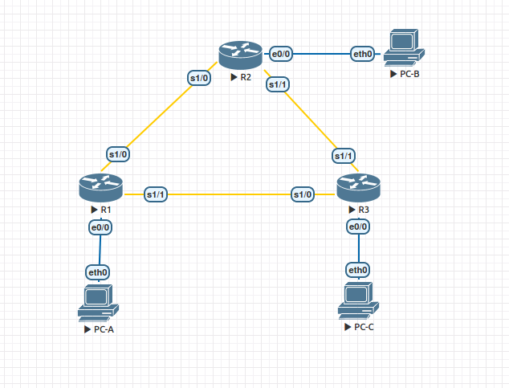

# Базовая настройка протокола EIGRP для IPv4

### Топология


### Таблица адресации
|Устройство|Интерфейс    |IP-адрес     |Маска подсети  |Шлюз по умолчанию|
|----------|-------------|-------------|---------------|-  |
|R1        |E0/0         |192.168.1.1  |255.255.255.0  |-  |
|          |S/1/0 (DCE)  |192.168.12.1 |255.255.255.252|-  |
|          |S/1/1        |192.168.13.1 |255.255.255.252|-  |
|          |Lo1          |192.168.11.1 |255.255.255.252|Н/Д|
|          |Lo5          |192.168.11.5 |255.255.255.252|-  |
|          |Lo9          |192.168.11.9 |255.255.255.252|-  |
|          |Lo13         |192.168.11.13|255.255.255.252|-  |
|R2        |E0/0         |192.168.2.1  |255.255.255.0  |-  |
|          |S/1/0        |192.168.12.2 |255.255.255.252|-  |
|          |S/1/1 (DCE)  |192.168.23.1 |255.255.255.252|-  |
|          |Lo1          |192.168.22.1 |255.255.255.252|-  |
|R3        |E0/0         |192.168.3.1  |255.255.255.0  |-  |
|          |S/1/0 (DCE)  |192.168.13.2 |255.255.255.252|-  |
|          |S/1/1        |192.168.23.2 |255.255.255.252|-  |
|          |Lo1          |192.168.33.1 |255.255.255.252|Н/Д|
|          |Lo5          |192.168.33.5 |255.255.255.252|-  |
|          |Lo9          |192.168.33.9 |255.255.255.252|-  |
|          |Lo13         |192.168.33.13|255.255.255.252|-  |
|PC-A      |NIC          |192.168.1.3  |255.255.255.0  |192.168.1.1|
|PC-B      |NIC          |192.168.2.3  |255.255.255.0  |192.168.2.1|
|PC-C      |NIC          |192.168.3.3  |255.255.255.0  |192.168.3.1|

### Задачи

Часть 1. Создание сети и настройка основных параметров устройства
Часть 2. Настройка EIGRP и проверка подключения
Часть 3. Настройка EIGRP для автоматического объединения
Часть 4. Настройка и распространение статического маршрута по умолчанию
Часть 5. Выполнение точной настройки EIGRP

### Выполнение

#### 1. Построение сети и проверка соединения
Выполним базовую настройку маршрутизаторов:
```
conf t
hostname RX
no ip domain-lookup
enable secret class
line console 0
password cisco
login
exec-timeout 0 0
exit
line vty 0 4
password cisco
login
exit
line aux 0
password cisco
login
exit
service password-encryption
banner motd $ Authorized Access Only! $
```

Выполним настройку интерфейсов.
