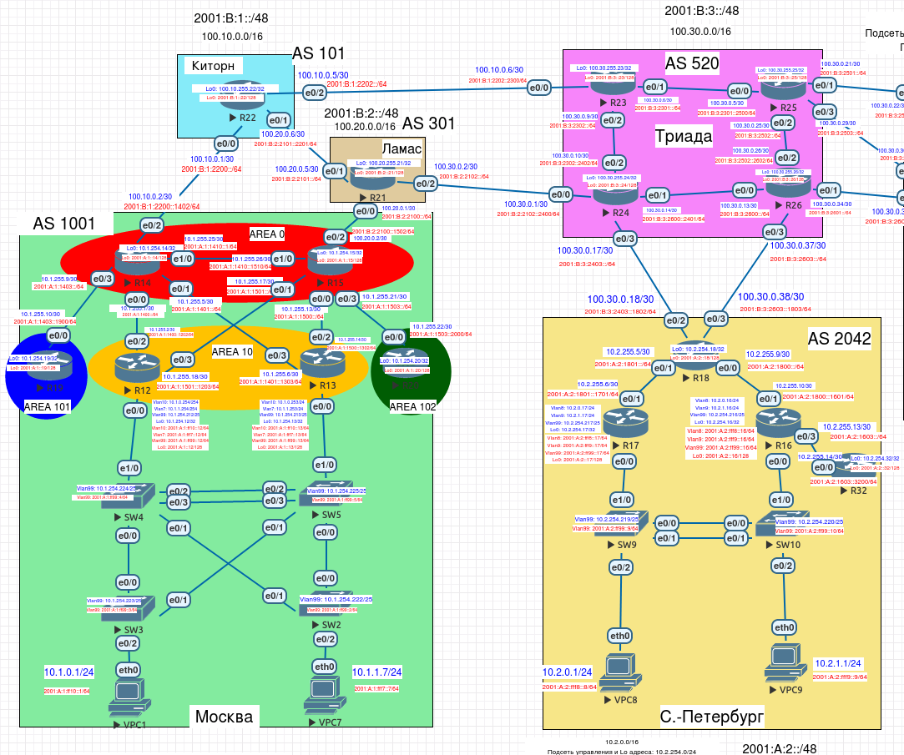

# Настройка eBGP

Необходимо настроить BGP между автономными системами и организовать доступность между офисами Москва и С.-Петербург.



Выполним настройку в следующей последовательности:
1. Настройка eBGP между офисом Москва и двумя провайдерами - Киторн и Ламас
2. Настройка eBGP между провайдерами Киторн и Ламас
3. Настройка eBGP между Ламас и Триада
4. Настройка eBGP между офисом С.-Петербург и провайдером Триада
5. Организовать IP доступность между офисами Москва и С.-Петербург

### 1. Настройка eBGP между офисом Москва и двумя провайдерами - Киторн и Ламас

Выполняем следующие настройки на маршрутизаторах:

Москва, AS 1001 (R14):
```
ip route 10.1.0.0 255.255.0.0 Null0
router bgp 1001
neighbor 100.10.0.1 remote-as 101
network 10.1.0.0 mask 255.255.0.0
```

Китрон, AS 101 (R22):
```
ip route 100.10.0.0 255.255.0.0 Null0
router bgp 101
neighbor 100.10.0.2 remote-as 1001
network 100.10.0.0 mask 255.255.0.0
```

Москва, AS 1001 (R15):
```
ip route 10.1.0.0 255.255.0.0 Null0
router bgp 1001
neighbor 100.20.0.1 remote-as 301
network 10.1.0.0 mask 255.255.0.0
```

Ламас, AS 301 (R21):
```
ip route 100.20.0.0 255.255.0.0 Null0
router bgp 301
neighbor 100.20.0.2 remote-as 1001
network 100.20.0.0 mask 255.255.0.0
```

### 2. Настройка eBGP между провайдерами Киторн и Ламас

Выполняем следующие настройки на маршрутизаторах:

Китрон, AS 101 (R22):
```
router bgp 101
neighbor 100.20.0.5 remote-as 301
```

Ламас, AS 301 (R21):
```
router bgp 301
neighbor 100.20.0.6 remote-as 101
```

### 3. Настройка eBGP между Ламас и Триада

Выполняем следующие настройки на маршрутизаторах:

Триада, AS 520 (R24):
```
ip route 100.30.0.0 255.255.0.0 Null0
router bgp 520
neighbor 100.30.0.2 remote-as 301
network 100.30.0.0 mask 255.255.0.0
```

Ламас, AS 301 (R21):
```
router bgp 301
neighbor 100.30.0.1 remote-as 520
```


### 4. Настройка eBGP между офисом С.-Петербург и провайдером Триада

Выполняем следующие настройки на маршрутизаторах:

С-Петербург, AS 2042 (R18):
```
ip route 10.2.0.0 255.255.0.0 Null0
router bgp 2042
neighbor 100.30.0.17 remote-as 520
neighbor 100.30.0.37 remote-as 520
network 10.2.0.0 mask 255.255.0.0
```

Триада, AS 520 (R24):
```
router bgp 520
neighbor 100.30.0.18 remote-as 2042
```

Триада, AS 520 (R26):
```
ip route 100.30.0.0 255.255.0.0 Null0
router bgp 520
neighbor 100.30.0.38 remote-as 2042
network 100.30.0.0 mask 255.255.0.0
```

### 5. Организуете IP доступность между офисами Москва и С.-Петербург

Т.к. в офисе в С.-Петербурге пока не используется протокол динамической маршрутизации, пропишем статические маршруты.


R17:
```
ip route 0.0.0.0 0.0.0.0 10.2.255.5
ipv6 route ::/0 2001:A:2:1801::1
```

R16:
```
ip route 0.0.0.0 0.0.0.0 10.2.255.9
ipv6 route ::/0 2001:A:2:1800::1
```

R32:
```
ip route 0.0.0.0 0.0.0.0 10.2.255.13
ipv6 route ::/0 2001:A:2:1603::1
```

R18:
```
ip route 10.2.0.0 255.255.0.0 10.2.255.6
ip route 10.2.0.0 255.255.0.0 10.2.255.10  
ipv6 route 2001:A:2::/48 2001:A:2:1801::1701
ipv6 route 2001:A:2::/48 2001:A:2:1800::1601
```

## Проверим IP связанность между офисами Москва и С-Петербург
```
VPC1> ping 10.2.1.1

84 bytes from 10.2.1.1 icmp_seq=1 ttl=58 time=2.247 ms
84 bytes from 10.2.1.1 icmp_seq=2 ttl=58 time=1.417 ms
84 bytes from 10.2.1.1 icmp_seq=3 ttl=58 time=1.302 ms
84 bytes from 10.2.1.1 icmp_seq=4 ttl=58 time=1.633 ms
84 bytes from 10.2.1.1 icmp_seq=5 ttl=58 time=1.465 ms

VPC1> trace 10.2.1.1

trace to 10.2.1.1, 8 hops max, press Ctrl+C to stop
 1   10.1.0.254   0.641 ms  0.343 ms  0.339 ms
 2   10.1.255.17   0.627 ms  0.515 ms  0.505 ms
 3   100.20.0.1   0.637 ms  0.785 ms  0.722 ms
 4   100.30.0.1   0.758 ms  0.549 ms  0.730 ms
 5   100.30.0.18   0.761 ms  0.679 ms  0.680 ms
 6   10.2.255.10   1.118 ms  1.164 ms  0.885 ms
 7   *10.2.1.1   1.124 ms (ICMP type:3, code:3, Destination port unreachable)
```
