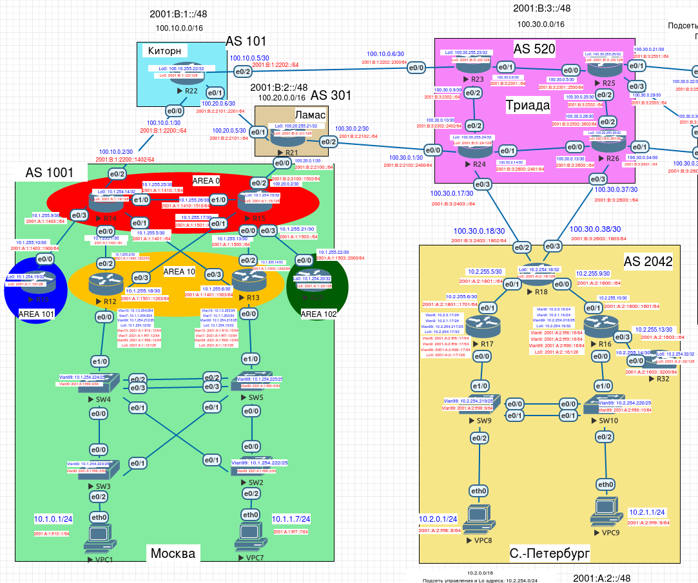

# Настройка iBGP

Необходимо настроить фильтрацию для офисе Москва, настроить фильтрацию для офисе С.-Петербург.



Выполним настройку в следующей последовательности:
1. Настроим фильтрацию в офисе Москва так, чтобы не появилось транзитного трафика(As-path)
2. Настроим фильтрацию в офисе С.-Петербург так, чтобы не появилось транзитного трафика(Prefix-list)
3. Настроим провайдера Киторн так, чтобы в офис Москва отдавался только маршрут по-умолчанию
4. Настроим провайдера Ламас так, чтобы в офис Москва отдавался только маршрут по-умолчанию и префикс офиса С.-Петербург

### 1. Настроим фильтрацию в офисе Москва так, чтобы не появилось транзитного трафика(As-path)

Выполняем следующие настройки на маршрутизаторах:

Москва, AS 1001 (R14):
```
ip as-path access-list 1 permit ^$
ip as-path access-list 1 deny .*

router bgp 1001
neighbor 100.10.0.1 filter-list 1 out
```

Москва, AS 1001 (R15):
```
ip as-path access-list 1 permit ^$
ip as-path access-list 1 deny .*

router bgp 1001
neighbor 100.20.0.1 filter-list 1 out
```

### 2. Настроим фильтрацию в офисе С.-Петербург так, чтобы не появилось транзитного трафика(Prefix-list)

Выполняем следующие настройки на маршрутизаторах:

С-Петербург, AS 2042 (R18):
```
ip prefix-list SPB_NTWRK seq 5 permit 10.2.0.0/16

router bgp 2042
neighbor 100.30.0.17 prefix-list SPB_NTWRK out
neighbor 100.30.0.37 prefix-list SPB_NTWRK out
```

### 3. Настроим провайдера Киторн так, чтобы в офис Москва отдавался только маршрут по-умолчанию

Выполняем следующие настройки на маршрутизаторах:

Киторн, AS 101 (R22):
```
ip prefix-list MSK seq 10 deny 0.0.0.0/0

router bgp 101
neighbor 100.10.0.2 default-originate
neighbor 100.10.0.2 prefix-list MSK out
```

### 4. Настроим провайдера Ламас так, чтобы в офис Москва отдавался только маршрут по-умолчанию и префикс офиса С.-Петербург

Выполняем следующие настройки на маршрутизаторах:

Ламас, AS 301 (R21):
```
ip prefix-list MSK seq 10 permit 10.2.0.0/16
ip prefix-list MSK seq 20 deny 0.0.0.0/0

router bgp 301
neighbor 100.20.0.2 default-originate
neighbor 100.20.0.2 prefix-list MSK out
```
