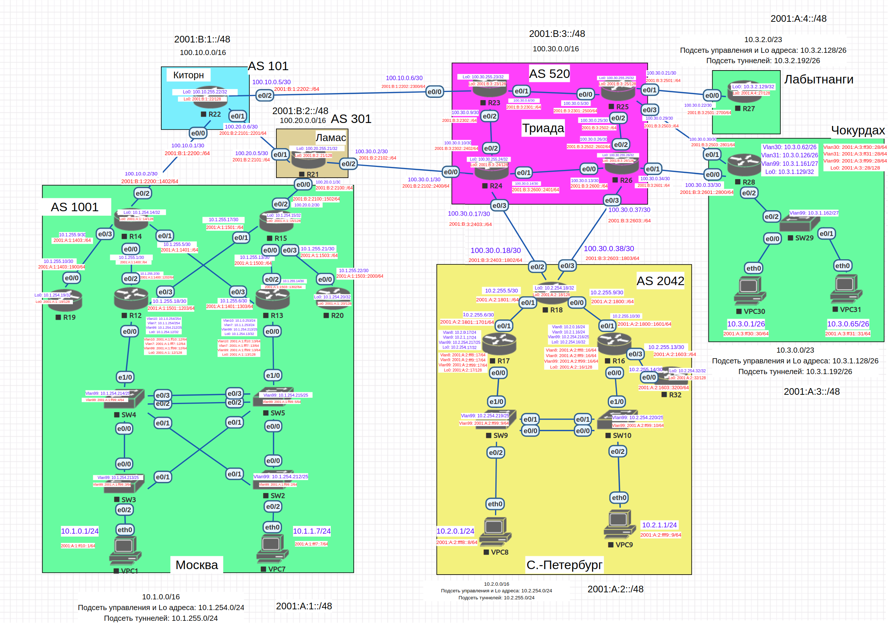

# Основные протоколы сети интернет

Необходимо настроить DHCP в офисе Москва Настроить синхронизацию времени в офисе Москва Настроить NAT в офисе Москва, C.-Перетбруг и Чокурдах.



Выполним настройку в следующей последовательности:
1. Настроим NAT(PAT) на R14 и R15. Трансляция должна осуществляться в адрес автономной системы AS1001
2. Настроим NAT(PAT) на R18. Трансляция должна осуществляться в пул из 5 адресов автономной системы AS2042
3. Настроим статический NAT для R20
4. Настроим NAT так, чтобы R19 был доступен с любого узла для удаленного управления
5. Настроим статический NAT(PAT) для офиса Чокурдах
6. Настроим DHCP сервер в офисе Москва на маршрутизаторах R12 и R13. VPC1 и VPC7 должны получать сетевые настройки по DHCP
7. Настроим NTP сервер на R12 и R13. Все устройства в офисе Москва должны синхронизировать время с R12 и R13

### 1. Настроим NAT(PAT) на R14 и R15. Трансляция должна осуществляться в адрес автономной системы AS1001

Выполняем следующие настройки на маршрутизаторах:

Москва, AS 1001 (R14, R15):
```
access-list 10 permit 10.1.0.0 0.0.255.255

ip nat inside source list 10 interface lo1 overload
interface range e0/0-1,e0/3,e1/0
ip nat inside
interface e0/2
ip nat outside
```

### 2. Настроим NAT(PAT) на R18. Трансляция должна осуществляться в пул из 5 адресов автономной системы AS2042

Выполняем следующие настройки на маршрутизаторах:

С-Петербург, AS 2042 (R18):
```
ip nat pool NAT-POOL 200.2.0.1 200.2.0.5 netmask 255.255.255.0

access-list 10 permit 10.2.0.0 0.0.255.255

ip nat inside source list 10 pool NAT-POOL overload
interface range e0/0-1
ip nat inside
interface range e0/2-3
ip nat outside
```

### 3. Настроим статический NAT для R20

Выполняем следующие настройки на маршрутизаторах:

Москва, AS 1001 (R15):
```
int lo1
ip address 200.1.0.220 255.255.255.255 secondary
ip nat inside source static 10.1.254.20 200.1.0.220
```

### 4. Настроим NAT так, чтобы R19 был доступен с любого узла для удаленного управления

Выполняем следующие настройки на маршрутизаторах:

Москва, AS 1001 (R14):
```
ip nat inside source static tcp 10.1.254.19 22 200.1.0.126 222
```

Москва, AS 1001 (R15):
```
ip nat inside source static tcp 10.1.254.19 22 200.1.0.254 222
```

### 5. Настроим статический NAT(PAT) для офиса Чокурдах

Выполняем следующие настройки на маршрутизаторах:

Чокурдах, R28:
```
access-list 10 permit 10.3.0.0 0.0.0.63
access-list 20 permit 10.3.0.64 0.0.0.63

ip nat inside source list 10 interface e0/0 overload
ip nat inside source list 20 interface e0/1 overload
interface e0/2
ip nat inside
interface range e0/0-1
ip nat outside
```

### 6. Настроим DHCP сервер в офисе Москва на маршрутизаторах R12 и R13. VPC1 и VPC7 должны получать сетевые настройки по DHCP

Москва, AS 1001 (R12, R13):

Выполняем настройка для протокола IPv4.

```
ip dhcp excluded-address 10.1.0.200 10.1.0.254
ip dhcp excluded-address 10.1.1.200 10.1.1.254
ip dhcp pool VLAN-10
network 10.1.0.0 255.255.255.0
default-router 10.1.0.200
exit
ip dhcp pool VLAN-7
network 10.1.1.0 255.255.255.0
default-router 10.1.1.200
exit
```

Выполняем настройка для протокола IPv6.

```
ipv6 dhcp pool VLAN-10
address prefix 2001:A:1:ff10::/64 lifetime infinite infinite
exit
interface e0/0.10
ipv6 dhcp server VLAN-10
ipv6 nd managed-config-flag

ipv6 dhcp pool VLAN-7
address prefix 2001:A:1:fff7::/64 lifetime infinite infinite
exit
interface e0/0.7
ipv6 dhcp server VLAN-7
ipv6 nd managed-config-flag
```

### 7. Настроим NTP сервер на R12 и R13. Все устройства в офисе Москва должны синхронизировать время с R12 и R13

Москва, AS 1001 (R12, R13):
```
ntp master
ntp update-calendar
int range e0/0-3
ntp broadcast
```

На остальных маршрутизаторах настроим NTP-клиент:
```
ntp server 10.1.254.12
ntp server 10.1.254.13
```
