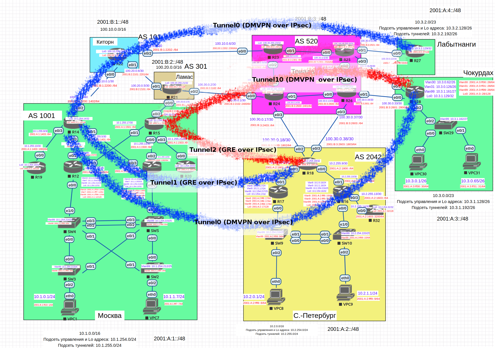

# IPSec

Необходимо настроить GRE между офисами Москва и С.-Петербург Настроить DMVPN между офисами Москва и Чокурдах, Лабытнанги.

Выполним настройку в следующей последовательности:
1. Настроим GRE поверх IPSec между офисами Москва и С.-Петербург
2. Настроим DMVPN поверх IPSec между Москва и Чокурдах, Лабытнанги



Перед тем как приступить к настройкам IPSec, настроим центр сертификации на маршрутизаторе R20:
```
ip domain-name otus.ru
ip http server
crypto key generate rsa general-keys label CA exportable modulus 2048
crypto pki server CA
no shut
```

### 1. Настроим GRE поверх IPSec между офисами Москва и С.-Петербург

Выполняем следующие настройки на маршрутизаторах:

Москва, AS 1001:

R14:
```
crypto key generate rsa label VPN modulus 2048
crypto pki trustpoint VPN
enrollment url http://10.1.254.20
subject-name CN=R14,OU=VPN,O=Otus,C=RU
rsakeypair VPN
revocation-check none
crypto pki authenticate VPN
crypto pki enroll VPN
```

R15:
```
crypto key generate rsa label VPN modulus 2048
crypto pki trustpoint VPN
enrollment url http://10.1.254.20
subject-name CN=R15,OU=VPN,O=Otus,C=RU
rsakeypair VPN
revocation-check none
crypto pki authenticate VPN
crypto pki enroll VPN
```

С.-Петербург, AS 2042 (R18):
```
crypto key generate rsa label VPN modulus 2048
crypto pki trustpoint VPN
enrollment url http://10.1.254.20
subject-name CN=R18,OU=VPN,O=Otus,C=RU
rsakeypair VPN
revocation-check none
crypto pki authenticate VPN
crypto pki enroll VPN
```

Настройка IPSec через сертификаты (R14, R15, R18):
```
crypto isakmp policy 10
authentication rsa-sig
crypto ipsec transform-set SET esp-aes esp-sha-hmac
crypto ipsec profile VTI_prof
set transform-set SET
```

Выдаем сертфикаты на маршрутизаторе R20:
```
crypto pki server CA grant all
```

После того, как все маршрутизаторы получили сертификаты, выполняем привязку интерфейсов.

Москва, AS 1001:

R14:
```

interface Tunnel1
tunnel protection ipsec profile VTI_prof
```

R15:
```

interface Tunnel2
tunnel protection ipsec profile VTI_prof
```

С.-Петербург, AS 2042 (R18):
```
interface Tunnel1
tunnel protection ipsec profile VTI_prof

interface Tunnel2
tunnel protection ipsec profile VTI_prof
```

### 2. Настроим DMVPN поверх IPSec между Москва и Чокурдах, Лабытнанги

Выполняем следующие настройки на маршрутизаторах:

Лабытнанги (R27):

```
crypto key generate rsa label VPN modulus 2048
crypto pki trustpoint VPN
enrollment url http://10.1.254.20
subject-name CN=R27,OU=VPN,O=Otus,C=RU
rsakeypair VPN
revocation-check none
crypto pki authenticate VPN
crypto pki enroll VPN

crypto isakmp policy 10
authentication rsa-sig
crypto ipsec transform-set SET esp-aes esp-sha-hmac
crypto ipsec profile VTI_prof
set transform-set SET
```

Чокурдах (R28):
```
crypto key generate rsa label VPN modulus 2048
crypto pki trustpoint VPN
enrollment url http://10.1.254.20
subject-name CN=R28,OU=VPN,O=Otus,C=RU
rsakeypair VPN
revocation-check none
crypto pki authenticate VPN
crypto pki enroll VPN

crypto isakmp policy 10
authentication rsa-sig
crypto ipsec transform-set SET esp-aes esp-sha-hmac
crypto ipsec profile VTI_prof
set transform-set SET
```

Выдаем сертфикаты на маршрутизаторе R20:
```
crypto pki server CA grant all
```

После того, как все маршрутизаторы получили сертификаты, выполняем привязку интерфейсов.

Москва, AS 1001:

R14:
```
interface Tunnel0
tunnel protection ipsec profile VTI_prof
```

R15:
```
interface Tunnel10
tunnel protection ipsec profile VTI_prof
```

Лабытнанги (R27):
```
interface Tunnel0
tunnel protection ipsec profile VTI_prof
```

Чокурдах (R28):
```
interface Tunnel0
tunnel protection ipsec profile VTI_prof
interface Tunnel10
tunnel protection ipsec profile VTI_prof
```
