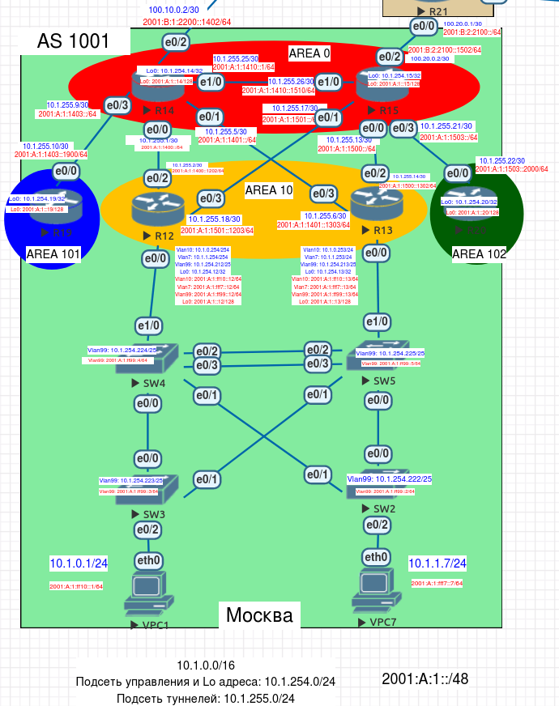

# Настройка OSPF офисе Москва

Выполним настройку OSPF согласно следующим требованиям:

1. Маршрутизаторы R14-R15 находятся в зоне 0 - backbone

2. Маршрутизаторы R12-R13 находятся в зоне 10. Дополнительно к маршрутам должны получать маршрут по-умолчанию

3. Маршрутизатор R19 находится в зоне 101 и получает только маршрут по умолчанию

4. Маршрутизатор R20 находится в зоне 102 и получает все маршруты, кроме маршрутов до сетей зоны 101

 

 

## 1. Настройка area 0

В зону 0 входят два маршрутизатора R14 и R15. Для того чтобы не использовать virtual-link соединим их напрямую через порты e1/0.

Выполним настройки OSPF:
R14:
```
router ospf 1
 passive-interface Ethernet0/2
 network 10.1.254.14 0.0.0.0 area 0
 network 10.1.255.0 0.0.0.3 area 10
 network 10.1.255.4 0.0.0.3 area 10
 network 10.1.255.8 0.0.0.3 area 101
 network 10.1.255.24 0.0.0.3 area 0
 network 100.10.0.0 0.0.0.3 area 0

```

R15:
```
router ospf 1
 passive-interface Ethernet0/2
 network 10.1.254.15 0.0.0.0 area 0
 network 10.1.255.12 0.0.0.3 area 10
 network 10.1.255.16 0.0.0.3 area 10
 network 10.1.255.20 0.0.0.3 area 102
 network 10.1.255.24 0.0.0.3 area 0
 network 100.20.0.0 0.0.0.3 area 0
```


## 2. Настройка area 10
В 10 зоне дополнительно к маршрутам требуется получать маршрут по-умолчанию, для этого определим эту зону как stub.

R12:
```
router ospf 1
 area 10 stub
 network 10.1.0.0 0.0.0.255 area 10
 network 10.1.1.0 0.0.0.255 area 10
 network 10.1.254.12 0.0.0.0 area 10
 network 10.1.254.128 0.0.0.127 area 10
 network 10.1.255.0 0.0.0.3 area 10
 network 10.1.255.16 0.0.0.3 area 10
```


R13:
```
router ospf 1
 area 10 stub
 network 10.1.0.0 0.0.0.255 area 10
 network 10.1.1.0 0.0.0.255 area 10
 network 10.1.254.13 0.0.0.0 area 10
 network 10.1.254.128 0.0.0.127 area 10
 network 10.1.255.4 0.0.0.3 area 10
 network 10.1.255.12 0.0.0.3 area 10
```

Также необходимо внести дополнительные настройки на R14 и R15:
```
router ospf 1
area 10 stub
```

## 3. Настройка area 101
Маршрутизатор в 101 зоне должен получать только маршрут по-умолчанию, для этого определим эту зону как total stub.
R19:
```
router ospf 1
 area 101 stub no-summary
 network 10.1.254.19 0.0.0.0 area 101
 network 10.1.255.8 0.0.0.3 area 101
```

Внесем изменения на R14 и R15:
```
router ospf 1
area 101 stub no-summary
```

## 3. Настройка area 102
Маршрутизаторы 102 зоны должны получать все маршруты, кроме маршрутов 101 зоны. Для этого на ABR R15 настроим фильтрацию подсетей маршрутизатора R19.
```
ip prefix-list FROM_R19 seq 10 deny 10.1.254.19/32
ip prefix-list FROM_R19 seq 20 deny 10.1.255.8/30 le 32
ip prefix-list FROM_R19 seq 30 permit 0.0.0.0/0 le 32

router ospf 1
area 102 filter-list prefix FROM_R19 in
```

Выполним настройки OSPF на R20:
```
router ospf 1
 network 10.1.254.20 0.0.0.0 area 102
 network 10.1.255.20 0.0.0.3 area 102
```
